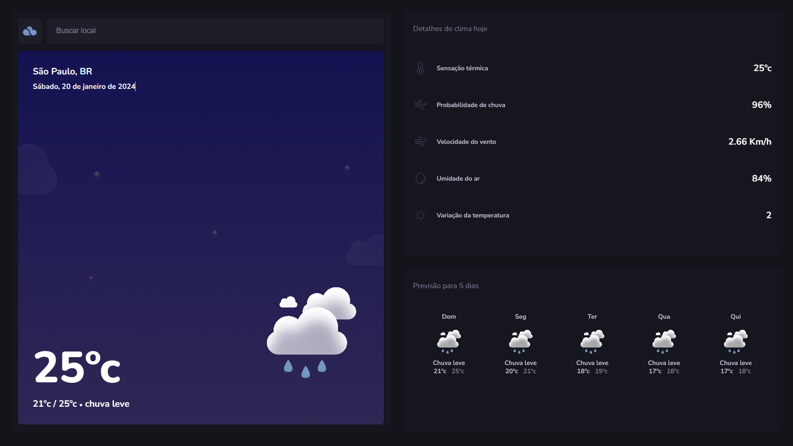

# TypeWeather

TypeWeather é uma aplicação web para consultar dados do tempo e previsões meteorológicas.

## 🎨 Layout

O layout da aplicação está disponível no Figma:

<a href="https://www.figma.com/file/rTBM1y2wfh0yWGmrCaYyim/TypeWeather-(Community)?node-id=3%3A376&mode=dev">
  
</a>

## 🚀 Começando

Estas instruções permitirão que você obtenha uma cópia do projeto funcionando em sua máquina para desenvolvimento e testes.

## 🔧 Instalação

### Pré-requisitos

Antes de começar, você precisará ter a seguinte ferramenta instalada em sua máquina:
[VSCode](https://code.visualstudio.com/)

Dentro do terminal do VSCode, escreva o seguinte código:

```
git init
```

```
git clone https://github.com/Gabrielingnau/TypeWeather
```
Instale as depêndecias com:

```
npm install
```

Depois é só rodar o projeto com:

```
npm run dev
```

## 🛠️ Tecnologias

* [React.js](https://react.dev/) - Biblioteca para interfaces de usuário  
* [Vite](https://vitejs.dev/) - Ferramenta para FrontEnd  
* [Typescript](https://www.typescriptlang.org/) - Sintaxe para tipos  

---
# ⌨️ com ❤️ por [Gabriel Lingnau](https://www.linkedin.com/in/gabriel-lingnau-3bb17b266/) 😊
=======
